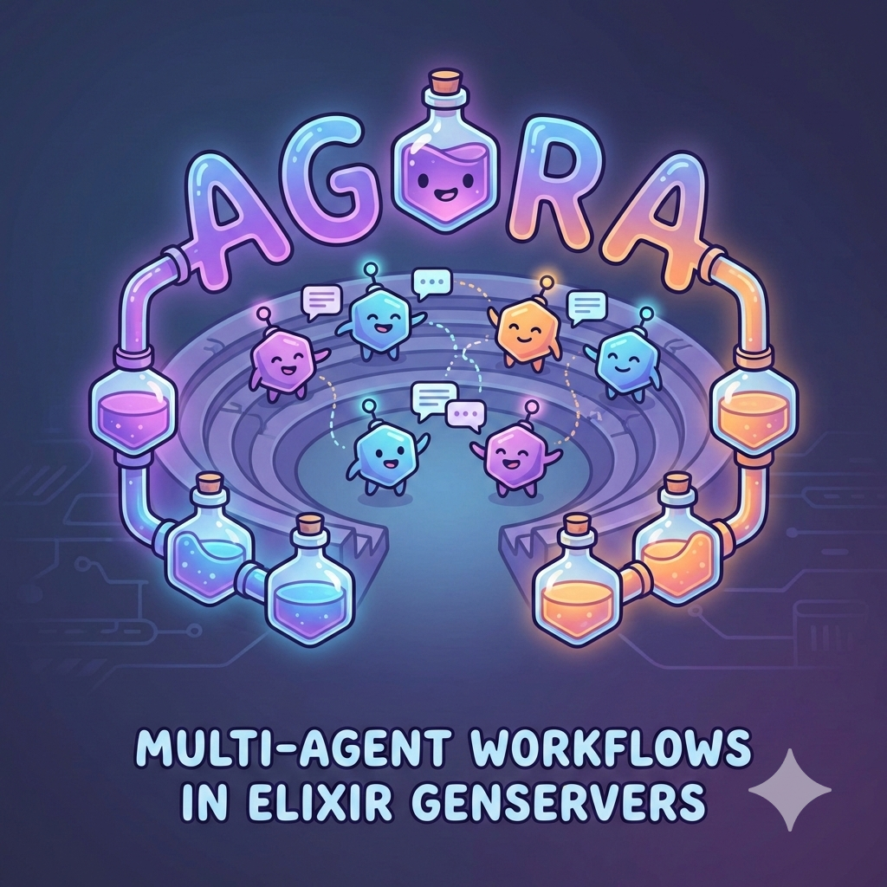

<p align="center">
  
</p>

<p align="center">
  <strong>Multi-agent runtime framework for Elixir</strong>
</p>

<p align="center">
  <a href="#installation">Installation</a> |
  <a href="#quick-start">Quick Start</a> |
  <a href="#providers">Providers</a> |
  <a href="#architecture">Architecture</a> |
  <a href="docs/Design-v0.md">Design Doc</a> |
  <a href="TODO.md">Roadmap</a>
</p>

---

Agora is a framework for building collaborative AI agents on the BEAM. Agents are supervised processes that coordinate through structured messaging and orchestration strategies, leveraging OTP for fault tolerance and concurrency.

## Features

- **Provider-agnostic** -- Unified interface across Anthropic, OpenAI, and custom LLM providers
- **Declarative agent config** -- Define agents with provider, model, instructions, tools, and middleware
- **Structured errors** -- Typed `{:ok, result} | {:error, %Error{}}` tuples throughout (no exceptions for control flow)
- **BEAM-native** -- Agents as supervised processes, tool execution via `Task.Supervisor`, per-run supervision trees
- **Middleware system** -- Composable interceptors for logging, budgets, approval gates, and custom behavior (planned)
- **Orchestration patterns** -- Round-robin, supervisor, chat-room, and DAG workflow execution (planned)

## Installation

Add `agora` to your dependencies in `mix.exs`:

```elixir
def deps do
  [
    {:agora, "~> 0.1.0"}
  ]
end
```

Then run:

```bash
mix deps.get
```

## Quick Start

### Configure API keys

Set environment variables for your providers:

```bash
export ANTHROPIC_API_KEY="sk-ant-..."
export OPENAI_API_KEY="sk-..."
```

Or configure in `config/runtime.exs`:

```elixir
config :agora,
  anthropic_api_key: System.get_env("ANTHROPIC_API_KEY"),
  openai_api_key: System.get_env("OPENAI_API_KEY")
```

### Run an agent

```elixir
alias Agora.{AgentConfig, Agent}

config = AgentConfig.new!(
  provider: :anthropic,
  model: "claude-sonnet-4-20250514",
  instructions: "You are a helpful assistant."
)

{:ok, pid} = Agent.start_link(config: config)
{:ok, response} = Agent.run(pid, "Hello!")

IO.puts(response.content)
# => "Hello! How can I help you today?"
```

### Agent with tools

```elixir
alias Agora.{AgentConfig, Agent}
alias Agora.Tool.Calculator

config = AgentConfig.new!(
  provider: :anthropic,
  model: "claude-sonnet-4-20250514",
  instructions: "Use the calculator tool when asked math questions.",
  tools: [Calculator]
)

{:ok, pid} = Agent.start_link(config: config)
{:ok, response} = Agent.run(pid, "What is 42 * 17?")
# Agent calls Calculator tool, feeds result back to LLM, returns final answer
```

### Supervised agents

```elixir
config = AgentConfig.new!(provider: :anthropic, model: "claude-sonnet-4-20250514")

# Start under the built-in DynamicSupervisor
{:ok, pid} = Agora.start_agent(config)
{:ok, response} = Agent.run(pid, "Hello!")

# Stop when done
Agora.stop_agent(pid)
```

### Direct provider calls

For one-off calls without the agent loop:

```elixir
alias Agora.{AgentConfig, Message, Provider}

config = AgentConfig.new!(
  provider: :anthropic,
  model: "claude-sonnet-4-20250514"
)

{:ok, response} = Provider.chat(:anthropic, [Message.user("Hello!")], config)
```

### Use OpenAI instead

```elixir
config = AgentConfig.new!(
  provider: :openai,
  model: "gpt-4o",
  instructions: "You are a helpful assistant."
)

{:ok, pid} = Agent.start_link(config: config)
{:ok, response} = Agent.run(pid, "Hello!")
```

### Per-agent provider options

```elixir
config = AgentConfig.new!(
  provider: :anthropic,
  model: "claude-sonnet-4-20250514",
  provider_opts: [
    api_key: "sk-ant-different-key",
    base_url: "https://my-proxy.example.com",
    timeout: 60_000,
    max_tokens: 8192
  ]
)
```

## Providers

| Provider | Module | Status |
|----------|--------|--------|
| Anthropic | `Agora.Provider.Anthropic` | Available |
| OpenAI | `Agora.Provider.OpenAI` | Available |
| Echo (test) | `Agora.Provider.Echo` | Available |

All providers implement the `Agora.Provider` behaviour:

```elixir
@callback chat(messages :: [Message.t()], config :: AgentConfig.t()) ::
  {:ok, Message.t()} | {:error, Error.t()}
```

### Provider-specific behavior

- **Anthropic** -- System messages extracted to top-level `system` parameter. Adjacent same-role messages merged automatically. Tool results sent as `user` role with `tool_result` content blocks.
- **OpenAI** -- System messages stay inline. Tool arguments encoded/decoded as JSON strings. One Agora tool message with N results expands to N separate OpenAI `tool` messages.
- **Echo** -- Six configurable modes for testing (`:echo`, `:fixed`, `:sequence`, `:error`, `:tool_call`, `:custom`). No HTTP calls.

## Architecture

```
User → Agent.run/2 → reasoning loop:
  Provider.chat/3 → response
    ├─ tool_calls? → ToolBroker.execute/2 → tool_results → loop
    └─ text only?  → return {:ok, Message.t()}
```

### Core modules

| Module | Purpose |
|--------|---------|
| `Agora.Agent` | GenServer with reasoning loop (provider call → tool execution → repeat) |
| `Agora.Agent.Supervisor` | DynamicSupervisor for agent lifecycle management |
| `Agora.AgentConfig` | NimbleOptions-validated configuration |
| `Agora.Provider` | Behaviour + resolution (`resolve/1` maps atoms to modules) |
| `Agora.Message` | Universal message struct (role, content, tool_calls, tool_results, metadata) |
| `Agora.Error` | Typed errors: `:provider_error`, `:auth_error`, `:rate_limit`, `:timeout`, etc. |
| `Agora.Tool` | Behaviour for defining tools + `FunctionTool` for inline definitions |
| `Agora.ToolBroker` | Supervised parallel tool execution with timeout enforcement |
| `Agora.Tool.Schema` | JSON Schema helpers for tool parameter validation |
| `Agora.Config` | Application-level config helpers with provider-namespaced keys |

### Config resolution order

Provider options follow a two-tier lookup:

1. `provider_opts` on the `AgentConfig` (per-agent)
2. Application config with provider-namespaced keys (e.g., `:anthropic_base_url`, `:openai_timeout`)

### HTTP testing

Providers accept `req_options` in `provider_opts` for test injection via `Req.Test`:

```elixir
config = AgentConfig.new!(
  provider: :anthropic,
  model: "claude-sonnet-4-20250514",
  provider_opts: [
    api_key: "test-key",
    req_options: [plug: {Req.Test, MyTest}]
  ]
)
```

## Roadmap

Agora follows a 10-phase implementation plan. See [TODO.md](TODO.md) for full details.

| Phase | Name | Status |
|-------|------|--------|
| 0 | Project Foundation | Complete |
| 1 | Provider Abstraction Layer | Complete |
| 2 | Tool System | Complete |
| 3 | Agent Runtime | Complete |
| 4 | Middleware System | Next |
| 5 | Orchestration | Planned |
| 6 | Memory System | Planned |
| 7 | Observability | Planned |
| 8 | Workflow Engine | Planned |
| 9 | Streaming Support | Planned |
| 10 | Top-Level API & Release | Planned |

## Development

```bash
mix deps.get                    # Install dependencies
mix test                        # Run all tests
mix test --only describe:"chat" # Run tests matching describe
mix format                      # Auto-format
mix dialyzer                    # Static type analysis
```

## License

[MIT](LICENSE) -- Copyright (c) 2026 Alex Afshar
