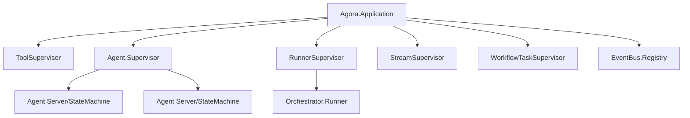

# Architecture

This guide explains the design principles and internal structure of Agora.

## Design Philosophy

Agora follows several core principles:

- **BEAM-native**: Agents are supervised processes. Tool execution, streaming, and orchestration use OTP patterns (GenServer, Task.Supervisor, DynamicSupervisor).
- **Structured errors**: Every operation returns `{:ok, result} | {:error, %Agora.Error{}}`. Exceptions are never used for control flow.
- **Provider-agnostic**: The `Agora.Provider` behaviour abstracts LLM interactions. Switching providers requires changing one config field.
- **Composable**: Middleware, termination conditions, and orchestrators compose naturally without framework coupling.

## Supervision Tree



All supervisors use `DynamicSupervisor` or `Task.Supervisor` for on-demand child management. Agent processes default to `:temporary` restart (no automatic restart) unless memory is configured, which switches to `:transient`.

## Core Data Flow

### Synchronous (`Agora.Agent.run/2`)

```
User → Agent.run/2 → reasoning loop:
  [before_provider_call middleware]
  Provider.chat/3 → response
  [after_provider_call middleware]
    ├─ tool_calls?
    │   [before_tool_call middleware]
    │   ToolBroker.execute/2 → tool_results
    │   [after_tool_call middleware]
    │   → loop
    └─ text only? → return {:ok, Message.t()}
```

### Streaming (`Agora.Agent.stream_run/2`)

```
User → Agent.stream_run/2 → streaming loop:
  Provider.stream_chat/3 → event stream
    [on_stream_event middleware per event]
    ├─ tool_calls in message?
    │   execute tools → emit :tool_result events
    │   → re-stream (new provider call)
    └─ text only? → emit :done, return Agora.Stream.t()
```

## Module Organization

### Core
- `Agora` -- Top-level convenience API (`run/2`, `stream/2`, `run_mode/3`, `run_workflow/1`)
- `Agora.Execution` -- Unified mode-first execution facade for orchestrators and workflows
- `Agora.ModeEvent` -- Typed event struct for streaming execution progress
- `Agora.CancelToken` -- Lock-free boundary-cooperative cancellation
- `Agora.ContextPolicy` -- Message compaction strategies for bounded context growth
- `Agora.Agent` -- Multi-backend agent facade (dispatches to Server or StateMachine)
- `Agora.Agent.Lifecycle` -- State machine lifecycle configuration (states, transitions, callbacks)
- `Agora.AgentConfig` -- NimbleOptions-validated configuration (`:lifecycle` field selects backend)
- `Agora.Message` -- Universal message struct (role, content, tool_calls, tool_results, metadata)
- `Agora.Error` -- 14 typed error categories

### Providers
- `Agora.Provider` -- Behaviour + resolution (atom → module mapping)
- `Agora.Provider.Anthropic` -- Anthropic Messages API
- `Agora.Provider.OpenAI` -- OpenAI Chat Completions API
- `Agora.Provider.Echo` -- Test/dev provider with 6 configurable modes

### Tools
- `Agora.Tool` -- Behaviour for defining tools
- `Agora.Tool.FunctionTool` -- Inline tool definitions
- `Agora.ToolBroker` -- Supervised parallel execution with deadline timeouts

### Middleware
- `Agora.Middleware` -- Behaviour for composable interceptors
- `Agora.Middleware.Chain` -- Plug-style chain executor

### Orchestration
- `Agora.Orchestrator` -- Behaviour controlling which agent runs
- `Agora.Orchestrator.Runner` -- GenServer driving orchestration loops

### Memory
- `Agora.Memory` -- Behaviour + dispatch for swappable backends

### Streaming
- `Agora.Stream` -- Enumerable wrapper with ownership enforcement
- `Agora.StreamEvent` -- 7 typed streaming event constructors
- `Agora.Provider.SSE` -- Shared SSE line parser
- `Agora.Provider.StreamAccumulator` -- Delta accumulator

### Workflows
- `Agora.Workflow.Builder` -- DSL for DAG construction
- `Agora.Workflow.Executor` -- Stateless executor with parallel fan-out

### Observability
- `Agora.Telemetry` -- 28 events across 11 prefixes
- `Agora.EventBus` -- Registry-backed pub/sub

## Error Handling

Agora uses typed errors throughout:

```elixir
%Agora.Error{
  type: :provider_error | :tool_error | :validation_error | :timeout | :rate_limit |
        :auth_error | :config_error | :iteration_limit | :middleware_error |
        :memory_error | :orchestration_error | :workflow_error | :streaming_error | :unknown,
  message: "Human-readable description",
  metadata: %{}  # optional context
}
```

All public functions return `{:ok, result} | {:error, %Error{}}`. Agent crash protection converts exceptions into `:unknown` errors.

## Config Resolution

Provider options follow a two-tier lookup:

1. `provider_opts` on the `AgentConfig` (per-agent override)
2. Application config with provider-namespaced keys (e.g., `:anthropic_base_url`)

```elixir
# Per-agent
config = AgentConfig.new!(provider: :anthropic, model: "claude-sonnet-4-20250514",
  provider_opts: [api_key: "sk-ant-...", timeout: 30_000])

# Application-level (config/runtime.exs)
config :agora,
  anthropic_api_key: System.get_env("ANTHROPIC_API_KEY"),
  anthropic_timeout: 60_000
```

## Telemetry

Agora emits `:telemetry` events at all key instrumentation points. See `Agora.Telemetry` moduledoc for the complete event reference, including measurements and metadata for each event.
